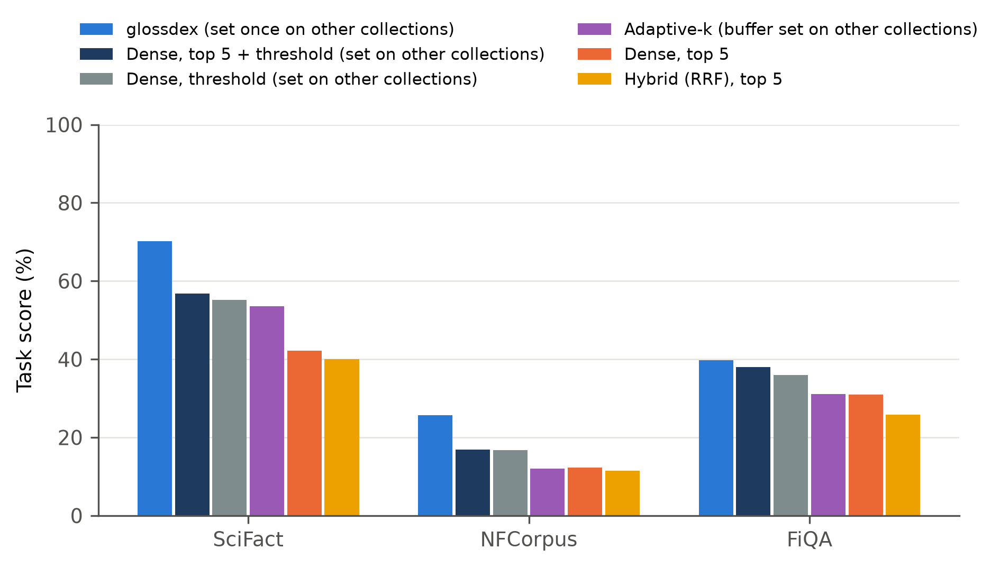

# Benchmark: evidence-gated result sets on public text collections

How well does glossdex decide **how many results to show, including none**, compared with
standard search that shows a fixed top k, a similarity threshold, and Adaptive-k? This benchmark answers that on three public BEIR
collections, with every system using the same embedding model so that only the search method
differs.

## Results

Task score: the average over all queries of a per-query score. A query that has answers scores the
F2 of the list shown (recall counted twice as much as precision). A query the collection cannot
answer scores 100 if nothing is shown, and 0 otherwise.

| Test collection | glossdex | Strongest baseline: threshold, top 5 | Ahead by (95% CI) | Best fixed top-k | Ahead by (95% CI) |
|---|---|---|---|---|---|
| SciFact (scientific claims) | **70.2** | 56.8 | +13.4 (+9.9 to +17.0) | 42.2 (dense, top 5) | +28.0 (+23.4 to +32.6) |
| NFCorpus (nutrition and medicine) | **25.7** | 16.9 | +8.8 (+7.0 to +10.7) | 14.2 (dense, top 10) | +11.6 (+7.8 to +15.4) |
| FiQA (finance questions) | **39.7** | 38.1 | +1.7 (+0.0 to +3.3) | 31.0 (dense, top 5) | +8.7 (+6.4 to +11.1) |

- **No answer:** glossdex shows nothing for 96–100% of the questions a collection cannot answer.
  A fixed top-k list and Adaptive-k never can. A similarity threshold can, but the one chosen on
  the development collections also shows nothing for 11–72% of answerable questions (glossdex:
  0.6–22%).
- **FiQA is close:** glossdex's lead over the threshold capped at top 5 is +1.7 (+0.0 to +3.3).
- **Ranking:** glossdex's nDCG@10 is level with dense retrieval (differences within ±1 point,
  every interval including zero). The difference is the result set.
- **Confidence intervals:** paired bootstrap over queries, 10,000 resamples, one fixed seed per
  comparison.

Every table, with all metrics and every pair of systems, is in
[`results/summary-test.md`](results/summary-test.md). Per-query results are in
`results/test-*.json`.



## Protocol

| | |
|---|---|
| Test collections | SciFact (5,183 documents, 300 test queries), NFCorpus (3,633 / 323), FiQA (57,638 / 648): BEIR test splits, every query and judgment as published |
| No-answer questions | 50 per test collection, from an unrelated collection: FiQA questions asked of SciFact and NFCorpus, SciFact claims asked of FiQA |
| Development collections | SciDocs, ArguAna, CQADupStack-webmasters. Settings are chosen on these only, never on a test collection. |
| Indexing | glossdex's text-only describer: each document (title + text, first 1,500 characters) is one passage, and its sentences are its phrases |
| Embedding model | EmbeddingGemma-300M (`google/embeddinggemma-300m`), the same vectors for every system |
| glossdex | The `embeddinggemma-300m/passages` profile (`EMBEDDINGGEMMA_PASSAGES`). Its result-set values (band 0.90, gate 0.52, minimum 1) were chosen by `tune.py` over 768 combinations on the development collections, then frozen in `text_profile.json` and applied once to the test collections. Ranking is the default profile's. |
| Fixed-cutoff baselines | **dense** (one vector per document, cosine), **BM25** (English stemming), **hybrid** (reciprocal-rank fusion of the two), each at a fixed top 5 and top 10 |
| Adaptive baselines | On the dense scores: **similarity threshold** (cosine ≥ 0.56, at most 50), **top 5 + threshold** (0.55), **Adaptive-k** (largest gap within the top 90%, plus a buffer: 1, and 5 as published). Chosen by `tune_baselines.py` on the development collections, frozen in `baseline_settings.json`. |

## Reproduce

```
pip install -e ".[st]" bm25s PyStemmer        # from the repository root
cd benchmarks/beir
python download.py                            # the six BEIR collections
python build_index.py scifact nfcorpus fiqa scidocs arguana webmasters
python tune.py --force                        # optional: re-derives text_profile.json
python tune_baselines.py --force              # optional: re-derives baseline_settings.json
python evaluate.py test
python summarize.py
```

`google/embeddinggemma-300m` is a gated model on Hugging Face. Accept its license and run
`hf auth login` once. Embedding FiQA takes about an hour on a laptop GPU.

## Limitations

- BEIR judgments are sparse, which lowers measured precision for every system alike.
- NFCorpus questions have about 38 loosely relevant documents each. Every system scores low there,
  and on answerable questions alone glossdex's F2 is 2.1 points below dense top-10.
- The no-answer questions come from other collections. They test the "nothing found" decision,
  not near-miss questions inside one domain; a threshold rejects them easily.
- glossdex shows nothing for 10% of answerable SciFact claims and 22% of answerable NFCorpus
  questions.
- The chosen band (0.90) is at the top of the range searched.
