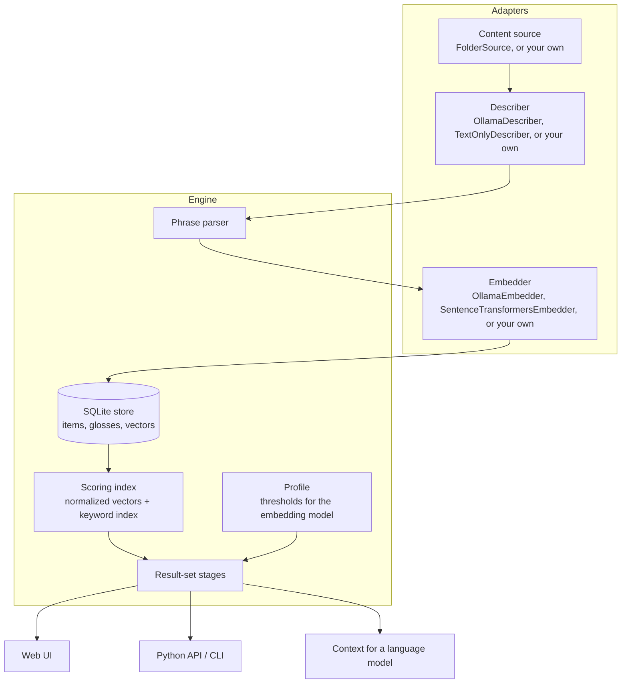

# Architecture

glossdex is one engine with three adapters around it. The engine knows nothing about images,
PDFs or any particular model. It sees items, descriptions and vectors.



## Indexing

For each new or changed item:

1. The **describer** returns raw text, usually one phrase per line.
2. The **phrase parser** (`glossdex.phrases`) splits it on line breaks and sentence ends. It
   strips list markers, chatter ("Sure, here is…") and filler ("The image shows…"), drops
   fragments and duplicates, and drops a cut-off final phrase if generation hit its length
   limit.
3. The **embedder** embeds the whole description and every phrase in its document mode.
4. The **store** replaces the item's previous analysis in one transaction.

Embedding item *k* runs in a background thread while item *k+1* is being described, because
the two usually run on different hardware. Items are keyed by path, plus a passage number for
documents, and versioned by modification time and size. Re-running `index` only touches what
changed, and removes what disappeared.

Documents are split into passages of up to about 1,500 characters at paragraph boundaries.
Each passage is an item. Its own text joins the keyword index, so exact identifiers, amounts
and names match even when the gloss leaves them out.

## Scoring (`glossdex.scoring.ScoringIndex.rank`)

Vectors are L2-normalized once, so a similarity is one dot product. For each item:

```
semantic = w · sim(query, whole gloss) + (1 − w) · softmax_τ(sim(query, phrase_i))
ranking  = semantic + β · coverage^γ      (only if semantic ≥ boost floor)
```

`coverage` is the rarity-weighted share of the query's content words that the item contains,
counting synonym classes and plural forms. It is normalized by an absolute ceiling, so a full
match on rare words approaches 1 and a full match on common words stays low.

## The result set (`glossdex.scoring.select`)

`top` is the best **semantic** score, not the best ranking score. Every threshold below is
derived from it.

| Stage | Rule | Shown when |
|---|---|---|
| Noise floor | `top < F` → nothing | the best match is stronger than unrelated text |
| Evidence gate | `top + G < T_gate` → nothing; `G` = BM25 over content words from in-band items + a bonus if any item in the collection contains every content word | a weak match has keyword evidence behind it |
| Band | keep `ranking ≥ max(f·top, F + h·(top − F))` | within a ratio of the best, measured from the floor |
| Coverage gap | `g = (C1 − C2)/C1` over the shown items (band plus any padding); `f' = min(0.95, f + k·g)`, recut. No query word anywhere → `g = 1` | one item clearly answers, so the rest are trimmed |
| Padding | below `min` items, append next-ranked items sharing ≥ `n` content words with `semantic ≥ p·top` and `≥ F` | a genuine second answer just missed the band |
| Flood guard | at most `max` items | always |

`Trace` records every number used, and the web UI renders it step by step.

## Profiles (`glossdex.profiles`)

All of `F, T_gate, f, h, k, w, τ, β, γ` live in a `Profile`, keyed by the embedding model's
`profile_key` and by the kind of content. Thresholds are in one model's score units, so they
follow the model, not the collection. `Profile.at_strictness(u)` implements the single strictness
control: `f = u`, and `F`, `h` and `T_gate` scale by `min(1, u / f_default)`.

Each model has two profiles. `descriptions` is for short glosses written by a describer model
and is the default. `passages` is for raw text indexed as written. `Glossdex` picks `passages`
when the describer is the text-only one. The two share every scoring value (`w, τ, β, γ`) and
differ only in the result set: for EmbeddingGemma, `f = 0.90`, `T_gate = 0.52` and a minimum of 1
for passages. `profile_for(key, override, content)` returns the profile, or the EmbeddingGemma
values for that content marked uncalibrated.

## Writing an adapter

```python
from glossdex import Item
from glossdex.describers import Description
from glossdex.phrases import parse_phrases

class MyCaptioner:
    name = "my-captioner"
    def describe(self, item: Item) -> Description:
        raw = call_my_model(item.path if item.kind == "image" else item.text)
        return Description(text=raw, phrases=parse_phrases(raw), model=self.name, seconds=0.0)

class MyEmbedder:
    name = "my-embedder"
    profile_key = "my-embedder"            # selects (or misses) a threshold profile
    def embed_documents(self, texts): ...  # -> np.ndarray [n, dims]
    def embed_query(self, text): ...       # -> np.ndarray [dims]
```
